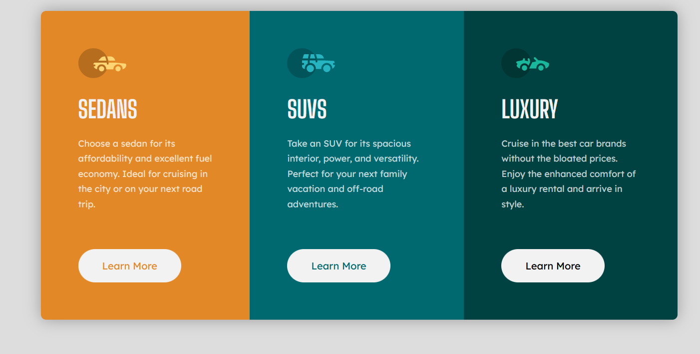

# Frontend Mentor - 3-column preview card component solution

This is a solution to the [3-column preview card component challenge on Frontend Mentor](https://www.frontendmentor.io/challenges/3column-preview-card-component-pH92eAR2-). Frontend Mentor challenges help you improve your coding skills by building realistic projects. 

## Table of contents

- [Overview](#overview)
  - [The challenge](#the-challenge)
  - [Screenshot](#screenshot)
  - [Links](#links)
  - [Built with](#built-with)
  - [What I learned](#what-i-learned)
- [Author](#author)
- [Acknowledgments](#acknowledgments)

**Note: Delete this note and update the table of contents based on what sections you keep.**

## Overview

### The challenge

Users should be able to:

- View the optimal layout depending on their device's screen size
- See hover states for interactive elements

### Screenshot

### Links

- Solution URL: [Add solution URL here](https://your-solution-url.com)
- Live Site URL: [Add live site URL here](https://your-live-site-url.com)

## My process

### Built with

- Semantic HTML5 markup
- CSS custom properties
- Flexbox

### What I learned

Flexbox is great for one-dimensional layouts. Building these cards allowed me to understand where to place flex properties. 

### Continued development

I need to continue developing projects with flexbox and css grid because they are crutial for responsive layouts.

## Author

- Website - [BlkShp-Alt](https://www.your-site.com)
- Frontend Mentor - [@blkshp-alt](https://www.frontendmentor.io/profile/blkshp-alt)

## Acknowledgments

Kevin Powell's video on building a responsive card with flexbox was helpful and allowed me to gain a better understanding of this layout

